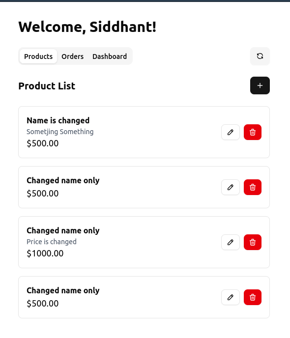
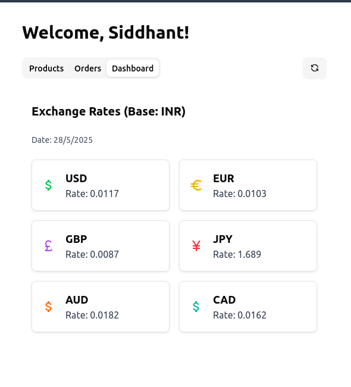
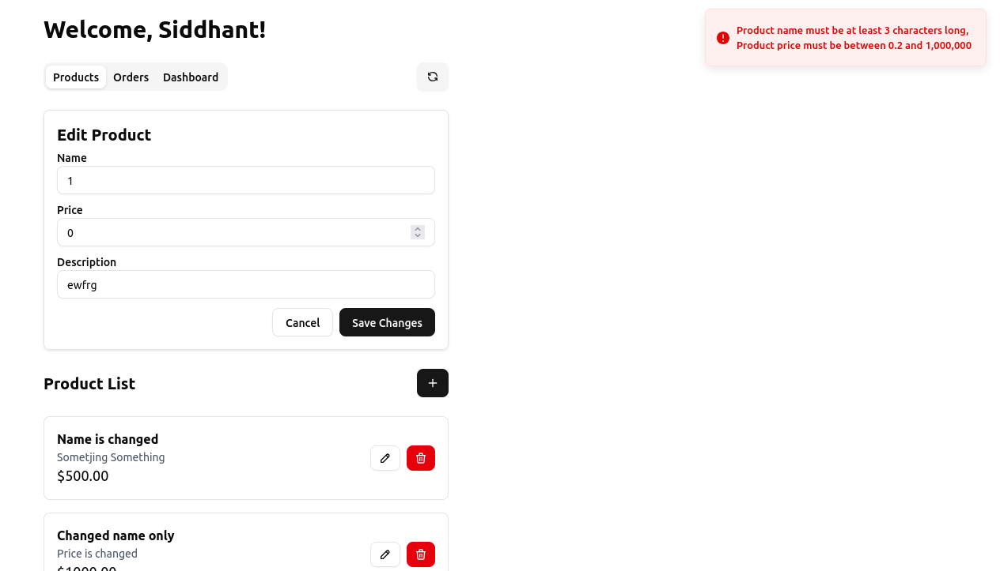

## Overview

This project is a full-stack application that implements product CRUD functionality, user authentication, order API development, and integration with an external currency exchange API.



## 🧰 Tech Stack

- **Backend:** Express 5.0 (with TypeScript), MongoDB (Mongoose), MySQL (Sequelize)
- **Frontend:** React.js, Redux Toolkit, TailwindCSS, ShadCN UI
- **Tools & Utilities:** Vite, ESLint, Express-Generator-Typescript, Sequelize CLI
- **External API:** [ExchangeRate API](https://v6.exchangerate-api.com/v6/) for live currency data
  - 

---

## 🚀 Features

- **Product Management (MongoDB):**
  - Full CRUD (Create, Read, Update, Delete) functionality for Products
  - Fields: `id`, `name`, `price`, `description`

- **User Authentication (MySQL):**
  - Registration and Login using MySQL via Sequelize ORM
  - Passwords securely hashed using `bcryptjs`
  - JWT-based token authentication
  - Sequelize CLI used for migration and model management

- **Order APIs:**
  - Create, retrieve, update, and delete Orders
  - Order includes `userId`, `productIds[]`, and `totalAmount`
  - Validations and standardized error handling for all endpoints

- **External API Integration:**
  - Currency exchange rates fetched from ExchangeRate API
  - Displayed live on the dashboard  
  

- **Robust Error Handling:**
  - Common error-handling middleware using **Express 5.0 syntax**:
    ```ts
    app.use((err: Error, _: Request, res: Response, _next: NextFunction) => {
      if (ENV.NodeEnv !== NodeEnvs.Test.valueOf()) {
        logger.err(err, true);
      }
      let status = HttpStatusCodes.BAD_REQUEST;
      if (err instanceof RouteError) {
        status = err.status;
        res.status(status).json({ msg: err.message });
        return;
      }
      res.status(HttpStatusCodes.INTERNAL_SERVER_ERROR).json({ msg: 'Internal Server Error' });
    });
    ```
  - Frontend
    - ```
      // Response interceptor to handle errors globally
        api.interceptors.response.use(
          (response) => {
            if (response.status === 201) {
              toast.success("Created", {
                description: (response.data && response.data.message) || "Resource created successfully.",
              });
            } 
            // else if (response.status >= 200 && response.status < 300) {
            //   toast.success("Success", {
            //     description: (response.data && response.data.message) || "Operation completed successfully.",
            //   });
            // }
            return response;
          },
          (error: AxiosError) => {
            const errorMessage = (error.response?.data as { msg?: string })?.msg || 'Something went wrong.';
            let toastTitle = "Error";
            let toastDescription = errorMessage;
            
            if (error.response) {
              console.error('API Error Response:', error.response.data);
              console.error('API Error Status:', error.response.status);
              console.error('API Error Headers:', error.response.headers);

              switch (error.response.status) {
                case 409:
                  toastTitle = "Already Exists";
                  toastDescription = errorMessage || "The resource already exists.";
                  break;
                case 404:
                  toastTitle = "Not Found";
                  toastDescription = errorMessage || "The requested resource was not found.";
                  break;
                case 400:
                  toastTitle = "Bad Request";
                  toastDescription = errorMessage || "Invalid request data.";
                  break;
                case 401:
                  toastTitle = "Unauthorized";
                  toastDescription = errorMessage || "Please log in again.";
                  console.log('Authentication failed!');
                  localStorage.removeItem('authToken'); // Logout the user by deleting the token
                  // Note: Redux state for authUser will be cleared on next app load or if you dispatch an action here.
                  break;
                default:
                  toastTitle = "Error";
                  toastDescription = errorMessage;
              }
            } else if (error.request) {
              console.error('API Error Request:', error.request);
              toastDescription = "No response received from server.";
            } else {
              console.error('API Error Message:', error.message);
              toastDescription = error.message;
            }

            toast.error(toastDescription ?? toastTitle);
            // toast.error(toastTitle, {
            //   description: toastDescription,
            // });

            return Promise.reject(error);
          }
        );
      ```
    * 

- **Security & Best Practices:**
  - Environment variables managed through `.env`
  - Passwords hashed with strong algorithms (`bcryptjs`)
  - JWT securely stored and verified through middleware
  - Separation of concerns with layered architecture:
    - `controllers/`,  `middlewares/`, `routes/`, and `utils/`
  - ESLint for consistent and clean codebase
  - Toast notifications for user feedback (ShadCN/Sonar)
  - Centralized error handler function on frontend

## Setup
  
### Backend

* Inside `backend/config` create three .env files `.env.development`, `.env.production`
* All the env variables are mandetory check by library called `jet-env`
  ```
  ## Environment ##
  NODE_ENV=development


  ## Server ##
  PORT=3073
  HOST=localhost


  ## Setup jet-logger ##
  JET_LOGGER_MODE=CONSOLE
  JET_LOGGER_FILEPATH=jet-logger.log
  JET_LOGGER_TIMESTAMP=TRUE
  JET_LOGGER_FORMAT=LINE

  MONGODB_CONNECTION_STRING=mongodb://127.0.0.1:27017/test

  DB_HOST=localhost
  DB_PORT=3306
  DB_USER=sid
  DB_PASSWORD=password
  DB_NAME=atdrive_assignment

  JWT_SECRET=COMPLICATED_STRING
  JWT_SECRET_EXPIRY_TIME=FALSE

  EXCHANGE_RATE_API_KEY=THE_KEY
  ```
* `yarn migrate` to create schema in MySQL database
* `yarn build` to build
* `yarn start` to start


### Frontend

* Create `frontend/.env` with `VITE_API_URL=http://localhost:3073`
* `yarn install`